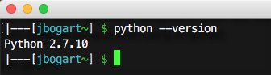
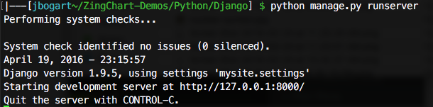
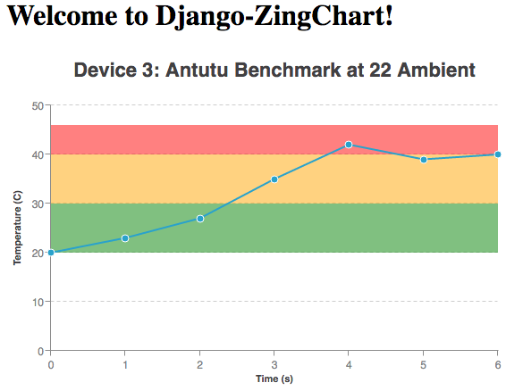
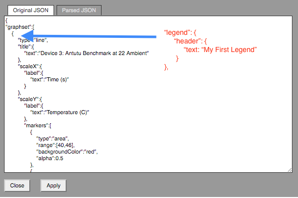

Django Charting Demo
--------------------

Python is serving as the back-end of our app and employs Django’s framework to give us a very nice and simple abstraction to get us away from having to configure a server from scratch.

The app we are building today will render a line chart using ZingChart with data gathered from our database via an AJAX call to one of our endpoints.

### Preparing the Environment
1. Python installed. Open a console or terminal and type `python --version`. If a version is reported, you’re good to go. If not, [download Python](https://www.python.org/downloads/). 

2. Django installed. One liner, just type into your console/terminal `pip install django`. **Note:** If you do not have pip installed the download Python version 2.7.10 or newer. Python comes with pip preinstalled on these versions. Then once you have installed Python you need to point to it with your Environment Variables Path.

3. Download this repo. Or you can clone it with the following command `git clone https://github.com/zingchart-demos/Python-Django.git`.

### Displaying Python Graphs
- cd to this directory.
- type into the terminal `python manage.py runserver`. The output should look something like this:

- The server is running now. So all we have to do is open our favorite browser and navigate to our [app](http://localhost:8000/zc_demo/index) *http://localhost:8000/zc_demo/index*



At this point we can customize the chart to do virtually anything we want. For a complete demonstration of this charting library's capabilities please see the documentation for [Your First Chart](http://www.zingchart.com/docs/getting-started/your-first-chart/). Just right click on the chart and select 'View Source' then modify the configuration according to the documentation listed above. For example, let's add a legend to our chart. Right click, then select 'View Source', then copy/paste the following text into your configuration.

```
"legend": {
    "header": {
        "text": "My First Legend"
    }
},
```


Also, note that you can interact with the rendered ZingChart to change any configuration you want by right clicking anywhere on the chart
and selecting 'View Source'. From there you can add, modify, or remove anything you like. Visit [zingchart](http://www.zingchart.com/docs/json-attributes-syntax/) for more information on how to customize your charts.

**Happy Charting**
